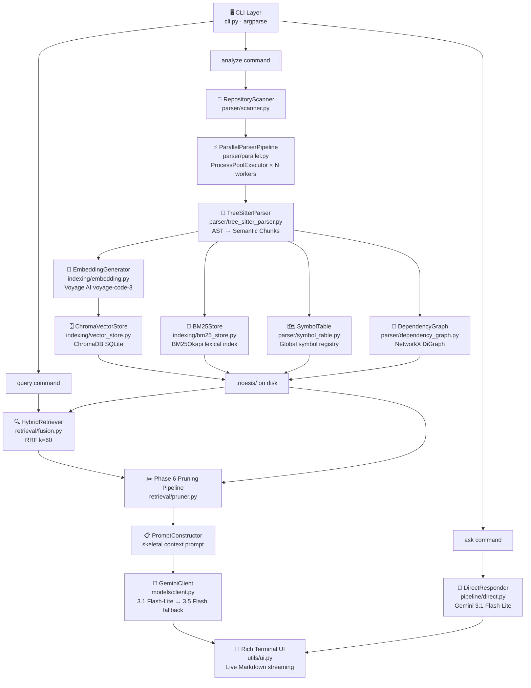
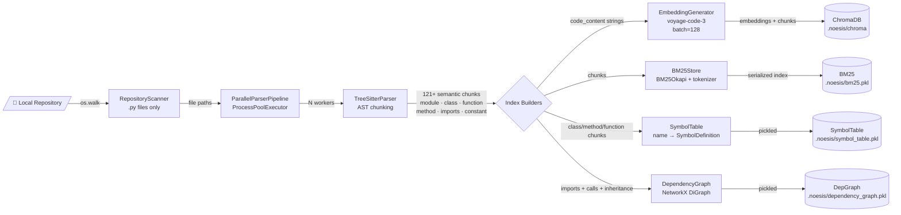
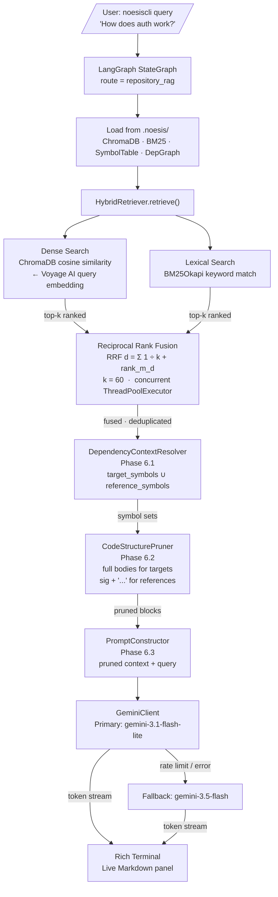
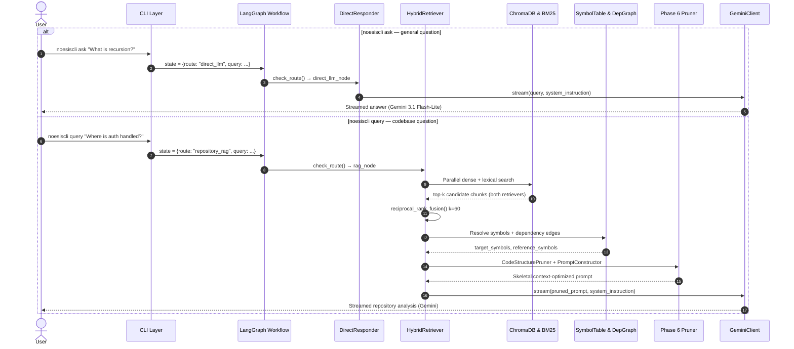

<div align="center">

# NoesisCLI

**A local-first, AI-powered codebase intelligence CLI.**
Index any Python repository, then interrogate it with natural language — backed by hybrid semantic + lexical retrieval, a structured dependency graph, context-aware pruning, and streaming Gemini reasoning.


</div>

---

## What is NoesisCLI?

NoesisCLI turns any local Python codebase into a queryable knowledge base without sending it to the cloud. It performs deep, AST-accurate code parsing, builds a global symbol registry and a dependency graph, and combines dense vector search with BM25 keyword search — all fused together before a context-pruned prompt is streamed through Gemini. The result is precise, grounded answers directly in your terminal.

---

## Tech Stack

Every component in the table below is fully implemented in this project.

| Component | Technology | Implementation |
|---|---|---|
| Programming Language | Python 3.12+ | `pyproject.toml` |
| Workflow Orchestration | LangGraph | `pipeline/graph.py` — `StateGraph` with conditional routing |
| LLM Framework | LangChain | `models/client.py` — `ChatGoogleGenerativeAI` via `langchain-google-genai` |
| Code Parsing | Tree-sitter | `parser/tree_sitter_parser.py` — full AST chunking with 6 bug-fix strategies |
| Parallel Processing | `concurrent.futures.ProcessPoolExecutor` | `parser/parallel.py` — N-worker multiprocess parsing |
| Symbol Table | Custom Registry | `parser/symbol_table.py` — `SymbolTable` + `SymbolDefinition` dataclass |
| Dependency Graph | NetworkX `DiGraph` | `parser/dependency_graph.py` — import / inherit / call edges |
| Embedding Model | Voyage AI `voyage-code-3` | `indexing/embedding.py` — batched via `voyageai` client |
| Inference Engine | Voyage AI HTTP Client | `indexing/embedding.py` — batch size 128, `input_type=query/document` |
| Vector Database | ChromaDB (SQLite-backed) | `indexing/vector_store.py` — `PersistentClient` collection |
| Lexical Search | BM25 (`rank-bm25`) | `indexing/bm25_store.py` — camelCase/snake_case tokenizer + `BM25Okapi` |
| Hybrid Retrieval | Custom Reciprocal Rank Fusion | `retrieval/fusion.py` — `HybridRetriever` + `reciprocal_rank_fusion()` (k=60) |
| CLI Framework | `argparse` (stdlib) | `cli.py` — `analyze`, `query`, `ask` subcommands |
| LLM | Gemini 3.1 Flash-Lite (primary) + Gemini 3.5 Flash (fallback) | `models/client.py` — lazy-init + auto-fallback on error |
| Streaming | LangChain streaming callbacks | `models/client.py` — `llm.stream()` → token generator |
| Terminal UI | Rich | `utils/ui.py` — live Markdown panel, progress bars, graceful fallback |
| Context Pruning | Custom (Tree-sitter-backed) | `retrieval/pruner.py` — `DependencyContextResolver`, `CodeStructurePruner`, `PromptConstructor` |
| Persistence | Pickle + ChromaDB on-disk | `.noesis/` directory inside target repo |

---

## System Architecture

The system is organized into seven logical phases, implemented across six decoupled packages:



---

## Data Flow Diagrams

### Indexing Pipeline (`analyze`)



### Query Pipeline (`query`)



### Routing Sequence



---

## Features

### 🌳 AST-Accurate Semantic Chunking
Tree-sitter parses every Python file into structured **Code Chunks** with exact line ranges — no character-count splitting. Nine chunk types are emitted:

| Chunk Type | Description |
|---|---|
| `module` | File docstring + aggregated import list |
| `imports` | All import statements (first-class chunk for Phase 4) |
| `class` | Full class body including all methods |
| `class_header` | Class signature + docstring + method signatures only (used as stubs by Phase 6) |
| `function` | Module-level function with full body |
| `method` | Class method with full body |
| `constant` | Top-level ALL_CAPS assignments |
| `type_alias` | `TypeVar`, `Union`, `TypeAlias`, etc. |
| `global` | Any other top-level statement block |

Six bug-fix strategies are applied: decorated definition handling, import isolation, per-file import collection, nested function containment, async detection, and class-body traversal correctness.

### ⚡ Multi-core Parallel Indexing
`ProcessPoolExecutor` distributes `TreeSitterParser` instances across all CPU cores. Each worker is a module-level function (fully picklable), constructs its own parser, and returns chunk lists. IPC overhead is amortised via batching. Configure with `--workers N`.

### 🔍 Hybrid Retrieval — Dense + Lexical + RRF
Both search strategies run **concurrently** in a `ThreadPoolExecutor`:

- **Dense**: Voyage AI `voyage-code-3` query embedding → ChromaDB cosine similarity
- **Lexical**: BM25Okapi over a camelCase/snake_case-aware tokenizer (`getUserId` → `["get", "user", "id"]`)

Results are merged via **Reciprocal Rank Fusion**:

```
RRF(d) = Σ_{m ∈ M}  1 / (k + rank_m(d))    k = 60
```

Chunks are deduplicated by `file_path:start_line:end_line:node_type` key. The final list is capped at `top_k` after fusion.

### 🗺️ Global Symbol Table
Indexes every `class`, `method`, and `function` declaration into `SymbolDefinition` records with: `symbol_name`, `node_type`, `file_path`, `start_line`, `end_line`, `parent_class`, `signature`, `docstring`, `is_async`, `decorators`, `base_classes`. Supports exact and case-insensitive fuzzy lookup. Persisted to `.noesis/symbol_table.pkl`.

### 🔗 Codebase Dependency Graph
A directed `networkx.DiGraph` with three edge relation types:

| Edge Type | Source → Target | Attribute |
|---|---|---|
| Import | `file` → `module` | `relation="imports"` |
| Inheritance | `class_name` → `base_class_name` | `relation="inherits"` |
| Call (best-effort) | `caller_name` → `callee_name` | `relation="calls"` |

Persisted to `.noesis/dependency_graph.pkl`.

### ✂️ Context-Aware Pruning (Phase 6)
Three-stage pipeline that produces a token-efficient skeletal prompt instead of raw file dumps:

1. **`DependencyContextResolver`** — walks retrieved chunks through the SymbolTable and DepGraph, classifying each symbol as *target* (keep full body) or *reference* (stub to signature + `...`)
2. **`CodeStructurePruner`** — reconstructs per-file views using pre-built `class_header` chunks as stubs; only target symbols retain their implementation bodies
3. **`PromptConstructor`** — assembles the final prompt with pruned file blocks, dependency metadata, file locations, and the user query

### 🤖 Fail-safe Gemini Client
Wraps all Gemini API calls via LangChain's `ChatGoogleGenerativeAI`:
- **Primary**: `gemini-3.1-flash-lite` (low latency, low cost)
- **Fallback**: `gemini-3.5-flash` (auto-switches on any exception: rate limit, quota, network)
- Lazy initialization — model objects are created only on the first API call
- Supports both `generate()` (blocking) and `stream()` (token generator) modes

### 🎨 Rich Terminal UI
- `stream_response()` — accumulates streamed LLM tokens into a `rich.live` panel with real-time Markdown rendering
- `make_progress()` — spinner + bar + M-of-N count + elapsed time for both parsing and embedding phases
- All UI functions degrade gracefully to plain `print()` when `rich` is not installed

---

## Installation

### Using uv (recommended)

```bash
git clone https://github.com/your-username/NoesisCLI.git
cd NoesisCLI
uv sync
```

### Using pip

```bash
git clone https://github.com/your-username/NoesisCLI.git
cd NoesisCLI
pip install -e .
```

**Requirements:** Python ≥ 3.12, a Voyage AI API key, a Google Gemini API key.

---

## Configuration

```bash
cp .env.example .env
```

```env
# Google Gemini
GOOGLE_API_KEY=your_google_api_key_here

# LLM Model overrides (optional — defaults shown)
GEMINI_PRIMARY_MODEL=gemini-3.1-flash-lite
GEMINI_FALLBACK_MODEL=gemini-3.5-flash

# Voyage AI
VOYAGE_API_KEY=your_voyage_api_key_here

# Internals (optional)
NOESIS_DIR_NAME=.noesis
LOG_LEVEL=INFO
```

> The index lives entirely inside `<repo>/.noesis/` — your code never leaves your machine.

---

## Usage

```bash
uv run -m noesiscli.cli <command> [options]
```

### `analyze` — Index a repository

```bash
uv run -m noesiscli.cli analyze <repo_path> [--force] [--workers N]
```

| Flag | Description |
|---|---|
| `repo_path` | Path to the local repository |
| `--force` | Re-index even if `.noesis/` already exists |
| `--workers N` | Parallel parser workers (default: all CPU cores) |

**Example output:**

```
Found 14 source file(s) in /path/to/repo.
  → 14 Python file(s) selected for parsing.

[Phase 5.1] Parallel AST parsing — 8 worker(s) / 14 file(s)
  Parsing with 8 worker(s) ━━━━━━━━━━━━━━━━━━━━━━━━━━━━━━━━━━━━━━━━ 14/14 0:00:01

  → Produced 121 semantic chunk(s) from 14 file(s).

[Phase 1.3] Generating embeddings via Voyage AI — 121 chunk(s)
  Embedding 121 chunk(s) via Voyage AI ━━━━━━━━━━━━━━━━━━━━━━━━━━━━━━━━━━━━━━━━ 121/121 0:00:03

Indexing chunks into ChromaDB...
  → ChromaDB index saved to '.noesis/chroma'
Building BM25 lexical index...
  → BM25 index saved to '.noesis/bm25.pkl'

Building Global Symbol Table...
  → Symbol Table saved to '.noesis/symbol_table.pkl' (85 definitions across 68 unique names)
Building Codebase Dependency Graph...
  → Dependency Graph saved to '.noesis/dependency_graph.pkl' (94 nodes, 54 edges)

Indexing completed successfully.
```

**Artifacts written to `.noesis/`:**

| Path | Contents |
|---|---|
| `chroma/` | SQLite-backed ChromaDB collection |
| `bm25.pkl` | Pickled `BM25Okapi` index + tokenized corpus |
| `symbol_table.pkl` | Pickled `SymbolTable` registry |
| `dependency_graph.pkl` | Pickled `networkx.DiGraph` |

---

### `query` — Ask a question about the codebase

```bash
cd /path/to/repo   # or use --repo-path
uv run -m noesiscli.cli query "How does authentication work?"
uv run -m noesiscli.cli query "Explain the data flow" --repo-path /path/to/repo
```

Loads all four `.noesis/` artifacts, runs hybrid retrieval, prunes context through Phases 6.1–6.3, and streams a Markdown-rendered answer.

---

### `ask` — General programming questions

```bash
uv run -m noesiscli.cli ask "What is the difference between a list and a generator?"
```

Skips retrieval entirely. Routes directly to `gemini-3.1-flash-lite` via `DirectResponder`.

---

## Project Structure

```
NoesisCLI/
├── noesiscli/
│   ├── cli.py                     # argparse entry point — analyze / query / ask
│   ├── config.py                  # Model names, .noesis/ path, language map
│   ├── parser/
│   │   ├── scanner.py             # RepositoryScanner (os.walk + ignore list)
│   │   ├── tree_sitter_parser.py  # TreeSitterParser — 9 chunk types, 6 bug-fix strategies
│   │   ├── parallel.py            # ParallelParserPipeline (ProcessPoolExecutor)
│   │   ├── symbol_table.py        # SymbolTable + SymbolDefinition dataclass
│   │   └── dependency_graph.py    # DependencyGraph — NetworkX DiGraph
│   ├── indexing/
│   │   ├── embedding.py           # EmbeddingGenerator — Voyage AI voyage-code-3
│   │   ├── vector_store.py        # ChromaVectorStore — PersistentClient
│   │   └── bm25_store.py          # BM25Store — BM25Okapi + camelCase tokenizer
│   ├── retrieval/
│   │   ├── fusion.py              # HybridRetriever + reciprocal_rank_fusion()
│   │   └── pruner.py              # DependencyContextResolver · CodeStructurePruner · PromptConstructor
│   ├── pipeline/
│   │   ├── state.py               # WorkflowState TypedDict
│   │   ├── graph.py               # WorkflowGraph — LangGraph StateGraph
│   │   ├── rag.py                 # RAGNode — Phase 6 integration + streaming
│   │   └── direct.py              # DirectResponder — general LLM path
│   ├── models/
│   │   └── client.py              # GeminiClient — primary/fallback, stream/generate
│   └── utils/
│       └── ui.py                  # stream_response · make_progress · embedding_progress
├── tests/
│   ├── conftest.py
│   ├── test_parser.py             # TreeSitterParser chunk extraction
│   ├── test_indexing.py           # EmbeddingGenerator · ChromaVectorStore · BM25Store
│   ├── test_retrieval.py          # HybridRetriever · RRF fusion
│   ├── test_pipeline.py           # WorkflowGraph · RAGNode · DirectResponder
│   └── test_models.py             # GeminiClient primary/fallback routing
├── docs/
│   ├── docs_pruner.md             # Phase 6 design reference
│   └── docs_tree_sitter.md        # Parser design reference
├── implementation.md              # Full phase-by-phase implementation plan
├── .env.example
├── pyproject.toml
└── requirements.txt
```

---

## Implementation Phases

| Phase | Status | Description |
|---|---|---|
| **1.1** CLI & Repository Ingestion | ✅ | `argparse` + `os.walk`, ignore list, file path collection |
| **1.2** Tree-sitter Parser | ✅ | 9 chunk types, 4 strategies, 6 bug fixes |
| **1.3** Voyage AI Embeddings | ✅ | `voyage-code-3`, batch=128, `input_type` switching |
| **1.4** ChromaDB Vector Store | ✅ | `PersistentClient`, SQLite, chunk + metadata storage |
| **1.5** Basic RAG | ✅ | Prototype retrieval + Gemini reasoning (superseded by Phase 3+6) |
| **2.1** LangGraph Workflow | ✅ | `StateGraph`, `WorkflowState`, node registration |
| **2.2** CLI Manual Routing | ✅ | `query` → `repository_rag`, `ask` → `direct_llm` |
| **2.3** Conditional Router | ✅ | `check_route()` function → `START` conditional edges |
| **2.4** Direct LLM Node | ✅ | `DirectResponder` → `gemini-3.1-flash-lite` |
| **3.1** BM25 Lexical Indexer | ✅ | `BM25Okapi`, camelCase/snake_case tokenizer, pickle |
| **3.2** Hybrid Retriever + RRF | ✅ | Concurrent `ThreadPoolExecutor`, RRF k=60, deduplication |
| **4.1** Global Symbol Table | ✅ | `SymbolDefinition` dataclass, exact + fuzzy lookup |
| **4.2** Dependency Graph | ✅ | NetworkX DiGraph, import/inherit/call edges |
| **5.1** Parallel Parser Pipeline | ✅ | `ProcessPoolExecutor`, module-level worker, progress callback |
| **6.1** Dependency Context Resolver | ✅ | Symbol classification: target vs. reference |
| **6.2** Code Structure Pruner | ✅ | `class_header` stub reuse, body replacement |
| **6.3** Prompt Constructor | ✅ | Pruned context + dependency metadata + query assembly |
| **7.1** Fail-safe LLM Client | ✅ | Primary → Fallback auto-switch on exception |
| **7.2** Directory & Persistence Manager | ✅ | `.noesis/` creation, pickle + ChromaDB serialization |
| **7.3** Rich Terminal UI | ✅ | `rich.live` Markdown, progress bars, graceful fallback |

---

## Code Chunk Schema

Every semantic chunk produced by `TreeSitterParser` follows this schema:

```python
{
    "code_content": str,       # Raw source text of the construct
    "file_path":    str,       # Absolute path to the source file
    "node_type":    str,       # See chunk types table above
    "start_line":   int,       # 1-indexed
    "end_line":     int,       # 1-indexed
    "metadata": {
        "imports_in_file": list[str],  # All imports in the file (for Phase 4)
        "decorators":      list[str],  # e.g. ["@staticmethod"]
        "is_async":        bool,
        "parent_class":    str | None,
        "is_dunder":       bool,       # __init__, __repr__, etc.
        "special_type":    str | None, # "property" | "staticmethod" | "classmethod" | ...
        "docstring":       str | None,
        "func_name":       str | None, # function / method chunks
        "class_name":      str | None, # class chunks
        "base_classes":    list[str],  # class chunks
        "module_docstring":str | None,
    }
}
```

---

## Testing

```bash
uv run pytest          # full suite
uv run pytest -v       # verbose
uv run pytest -x       # stop on first failure
```

API calls are bypassed in all tests via `PYTEST_CURRENT_TEST` environment detection — `EmbeddingGenerator` returns dummy 1536-dim vectors and `GeminiClient` is mocked.

---

## License

[MIT License](LICENSE)

---

<div align="center">
<sub>Tree-sitter &nbsp;·&nbsp; Voyage AI &nbsp;·&nbsp; ChromaDB &nbsp;·&nbsp; BM25 &nbsp;·&nbsp; NetworkX &nbsp;·&nbsp; LangGraph &nbsp;·&nbsp; LangChain &nbsp;·&nbsp; Gemini &nbsp;·&nbsp; Rich</sub>
</div>
