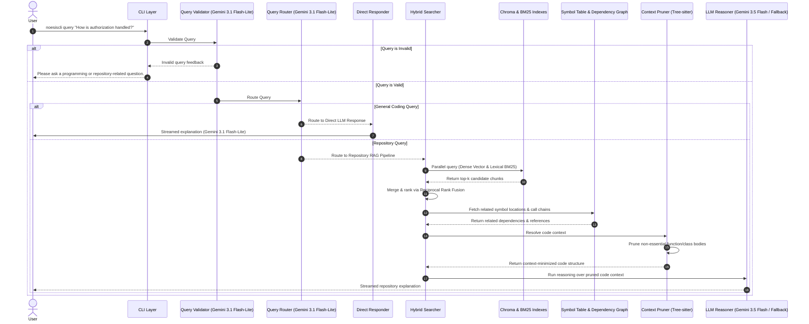

# NoesisCLI Implementation Plan

This document outlines the step-by-step implementation plan for **NoesisCLI**, a local AI-powered codebase architect. The implementation is divided into logical phases, starting with a working base model in Phase 1, followed by adding orchestration, search improvements, relationship tracking, parallelization, metadata enrichment, context optimization, and final robust fallbacks.

---

## [x] Phase 1 — Core CLI & Base RAG Pipeline (Working Base Model)
**Objective:** Build a minimal end-to-end local RAG pipeline to ingest a repository, parse Python code using Tree-sitter, compute embeddings using Voyage AI's API, store them in ChromaDB, retrieve relevant chunks, and stream answers from Gemini via a CLI interface.

### [x] 1.1: CLI Setup & Repository Ingestion
* **What it does:** Establishes the basic CLI entry point and scans a local directory to find Python files, ignoring files matching standard patterns (like `.venv`, `__pycache__`, `.git`).
* **What it takes (Inputs):**
  * Command-line arguments: `noesiscli analyze <repo_path>` and `noesiscli query "<prompt>"`.
* **What it returns (Outputs):**
  * A list of absolute file paths to python files `List[str]`.
* **Technical details:** Use Python's built-in `argparse` module and `os.walk` to scan directories.
* **Interconnections & Data Flow:**
  * **Inputs from:** User shell execution commands parsed via CLI Layer (Phase 8.3).
  * **Outputs to:** Parsed file paths list goes to Tree-sitter Parser (Phase 1.2 / Phase 5.2) for AST construction, raw source files go to Code Structure Pruner (Phase 7.2) for skeletal structure creation, and root path goes to Directory Manager (Phase 8.2) to specify the `.noesis/` storage location.

### [x] 1.2: Tree-Sitter Parser & Base Semantic Chunker
* **What it does:** Uses Tree-sitter to parse Python files into ASTs, extracting modules, class definitions, method definitions, functions, imports, constants, type aliases, and global blocks as semantic chunks. Preserves decorators, async structures, and exact block line ranges without splitting by character counts.
* **What it takes (Inputs):**
  * A list of python file paths `List[str]`.
* **What it returns (Outputs):**
  * A list of structured Code Chunk dictionaries/objects, each containing:
    * `code_content`: The raw source code of the chunk.
    * `file_path`: Absolute path of the source file.
    * `node_type`: `module`, `imports`, `class`, `class_header`, `method`, `function`, `constant`, `type_alias`, or `global`.
    * `start_line` / `end_line`: 1-indexed integers representing the position in the file.
    * `metadata`: Structured dictionary containing `decorators`, `is_async`, `parent_class`, `is_dunder`, `special_type`, `docstring`, and `imports_in_file`.
* **Technical details:** Use `tree-sitter` and the `tree-sitter-python` grammar. Implement the following specialized strategies and bug fixes:
  * **Strategies:**
    * **[S1] Module-level chunking:** Emit a `module` chunk containing the file docstring, aggregated import list, and file-level metadata.
    * **[S2] Class-header chunking:** Emit class signature + docstring + method signatures only (no bodies) as `class_header` chunks alongside full class chunks to provide context templates.
    * **[S3] Global node classification:** Classify global nodes as `constant`, `type_alias`, or `global` based on their AST shape rather than lumping everything under `global`.
    * **[S4] Per-chunk metadata:** Attaches decorator lists, `is_async` flags, `parent_class`, `is_dunder` flags, special type tags (e.g. `@property`, `@staticmethod`, `@classmethod`), docstrings, and file-level `imports_in_file` to every chunk.
  * **Bug Fixes:**
    * **[Fix 1] Decorated definitions:** Walk `decorated_definition` in `_extract_chunks_from_node` so decorator lines are always included in the extracted `code_content`.
    * **[Fix 2] Import statement isolation:** Import statements do NOT flush global blocks; they are collected separately so they never cause unrelated global nodes to be fragmented.
    * **[Fix 3] Per-file import collection:** Collect imports per-file so every chunk carries the file's import list for downstream phases like Phase 4 (Dependency Graph).
    * **[Fix 4] Nested functions:** Do not recurse into nested functions from within a parent `function_definition` traversal path so they remain embedded in the parent's `code_content` and avoid duplication.
    * **[Fix 5] Async functions:** Detect async functions by inspecting child tokens of a `function_definition` for the `async` keyword, ensuring no async structures are missed.
    * **[Fix 6] Class body traversal:** Walk the explicit `block` child of a class definition rather than iterating all children, avoiding accidental double-traversal of name/colon/base-class nodes.
* **Interconnections & Data Flow:**
  * **Inputs from:** List of file paths from CLI Setup & Ingestion (Phase 1.1).
  * **Outputs to:** Voyage AI Embedding Generator (Phase 1.3) and Dense Vector Storage (Phase 1.4) during basic RAG.
  * **Integration Notes:** Acts as the foundation for the Parallel Multi-Language Parser Pipeline (Phase 5). Chunks generated here are later enriched in Metadata Extractor (Phase 6.1) and BM25 indexing (Phase 3.1).

### [x] 1.3: Voyage AI Embedding Generator
* **What it does:** Generates embeddings in batches using Voyage AI's `voyage-code-3` API call model.
* **What it takes (Inputs):**
  * A list of Code Chunk objects.
* **What it returns (Outputs):**
  * A list of floating-point embedding vectors `List[List[float]]` corresponding to each chunk.
* **Technical details:** Use the `voyageai` client library or direct HTTP requests to call the Voyage AI embedding API, passing inputs in batches to maximize throughput.
* **Interconnections & Data Flow:**
  * **Inputs from:** Code chunks (Phase 1.2 / Phase 5.2) or enriched summarized chunks (Phase 6.3) during ingestion. User queries (Phase 1.5 / Phase 3.2) during retrieval.
  * **Outputs to:** Dense Vector Storage (Phase 1.4) or Multi-Vector Indexing (Phase 6.3) to write code and summary embeddings.

### [x] 1.4: Dense Vector Storage (ChromaDB)
* **What it does:** Initializes a local ChromaDB instance, creates/loads a collection, and indices the generated embeddings along with code content and basic metadata.
* **What it takes (Inputs):**
  * List of Code Chunk objects and their generated embeddings.
* **What it returns (Outputs):**
  * A persistent ChromaDB database saved on disk under the repository's `.noesis/` directory.
* **Technical details:** Use the `chromadb` client to manage a local SQLite-backed collection.
* **Interconnections & Data Flow:**
  * **Inputs from:** Embeddings from Voyage AI Generator (Phase 1.3) and chunks from Chunker (Phase 1.2 / Phase 6.3).
  * **Outputs to:** Similarity search query results for Basic Retrieval (Phase 1.5) and Hybrid Retriever (Phase 3.2).
  * **Integration Notes:** Database lifetime and serialization on disk are managed by Directory & Persistence Manager (Phase 8.2).

### [x] 1.5: Basic Retrieval & LLM reasoning (Gemini)
* **What it does:** Converts a user query into an embedding, performs a similarity search in ChromaDB, builds a prompt containing the retrieved context, and queries Gemini 3.5 Flash to stream the response.
* **What it takes (Inputs):**
  * User query string.
  * Retrieved relevant code chunks.
* **What it returns (Outputs):**
  * Streamed text response outputted to the terminal in real time.
* **Technical details:** Integrate LangChain's Gemini bindings (`langchain-google-genai`) and enable streaming callbacks to print tokens as they arrive.
* **Interconnections & Data Flow:**
  * **Inputs from:** User query (Phase 1.1) and ChromaDB search query results (Phase 1.4).
  * **Outputs to:** Direct CLI terminal printing (Phase 8.3).
  * **Integration Notes:** This prototype is fully replaced by the LangGraph Workflow Orchestration (Phase 2), Hybrid Retrieval (Phase 3), Context Pruning (Phase 7), and Fail-safe LLM Client (Phase 8.1) in the final setup.

---

## [x] Phase 2 — Workflow Orchestration, Validation, & Routing (LangGraph)
**Objective:** Orchestrate the application workflow using LangGraph, incorporating security/usefulness validation and query routing before invoking any RAG pipeline components.

### [x] 2.1: LangGraph Workflow Setup
* **What it does:** Creates a state machine representing the lifecycle of NoesisCLI queries (Validation Node -> Router Node -> Direct LLM Node / RAG Pipeline Node).
* **What it takes (Inputs):**
  * A state dictionary containing `query`, `is_valid`, `route`, `context_chunks`, and `response`.
* **What it returns (Outputs):**
  * Compilation of the LangGraph execution flow.
* **Technical details:** Use `langgraph.graph.StateGraph` to define nodes and conditional edges.
* **Interconnections & Data Flow:**
  * **Inputs from:** CLI User Interface (Phase 8.3) passing the raw query.
  * **Outputs to:** Controls and dispatches the execution flow to Query Validation (Phase 2.2), Query Router (Phase 2.3), Direct Responder (Phase 2.4), Hybrid Retriever (Phase 3.2), Context Pruner (Phase 7.3), and LLM Reasoner (Phase 8.1).

### [x] 2.2: Query Validation Layer
* **What it does:** Evaluates the incoming prompt using Gemini 3.1 Flash-Lite to confirm that the query is programming-related or repository-related.
* **What it takes (Inputs):**
  * Raw user prompt.
* **What it returns (Outputs):**
  * Boolean flag `is_valid` indicating validity.
  * Rejection message `feedback` if the query is invalid (e.g., asking for weather or movie recommendations).
* **Technical details:** Pass the query to Gemini 3.1 Flash-Lite with a system prompt specifying categorization rules. If invalid, the graph routes directly to a terminal node that outputs the feedback.
* **Interconnections & Data Flow:**
  * **Inputs from:** Raw query via LangGraph State (Phase 2.1).
  * **Outputs to:** Validation results state update (`is_valid`) in LangGraph. If validation fails, triggers response feedback printing in CLI (Phase 8.3).
  * **Integration Notes:** Dispatches all API requests through the central Fail-safe LLM Client (Phase 8.1).

### [x] 2.3: Intelligent Query Router
* **What it does:** Categorizes valid coding queries into two paths: General Coding (answered directly) and Repository-Specific (requires RAG pipeline).
* **What it takes (Inputs):**
  * Valid user query.
* **What it returns (Outputs):**
  * A routing flag: `"direct_llm"` or `"repository_rag"`.
  * **Technical details:** Use Gemini 3.1 Flash-Lite to classify the query. For example, "What is encapsulation?" goes to `direct_llm`, whereas "Where is the DB configured?" goes to `repository_rag`.
* **Interconnections & Data Flow:**
  * **Inputs from:** Verified query from State after Query Validation (Phase 2.2) succeeds.
  * **Outputs to:** Controls the conditional edge route in LangGraph: routing to Direct LLM Responder (Phase 2.4) or Hybrid Retriever (Phase 3.2).
  * **Integration Notes:** Performs model queries via the Fail-safe LLM Client (Phase 8.1).

### [x] 2.4: Direct LLM Route Execution
* **What it does:** Implements the fast direct answer path for general questions using Gemini 3.1 Flash-Lite, saving the system from searching ChromaDB or loading code.
* **What it takes (Inputs):**
  * General programming query.
* **What it returns (Outputs):**
  * Streamed response answering the general coding question.
* **Interconnections & Data Flow:**
  * **Inputs from:** Router decision in state (Phase 2.3) when set to `"direct_llm"`.
  * **Outputs to:** Streams response tokens directly to CLI Layer (Phase 8.3).
  * **Integration Notes:** Communicates with Gemini 3.1 Flash-Lite using the Fail-safe LLM Client (Phase 8.1).

---

## [ ] Phase 3 — Lexical Indexing & Hybrid Retrieval
**Objective:** Implement keyword search alongside semantic search and combine them via rank fusion for optimal retrieval accuracy.

### [ ] 3.1: Lexical BM25 Indexer
* **What it does:** Tokenizes and builds a BM25 keyword search index of the parsed code chunks.
* **What it takes (Inputs):**
  * A list of Code Chunk objects.
* **What it returns (Outputs):**
  * A serialized BM25 index file stored in `.noesis/bm25.pkl`.
* **Technical details:** Use a library like `rank_bm25` or build a custom BM25 index. Use python's `pickle` or a dedicated library to save/load it.
* **Interconnections & Data Flow:**
  * **Inputs from:** Code chunks (Phase 1.2 / Phase 5.2 / Phase 6.3).
  * **Outputs to:** Saved BM25 index persisted/loaded via Directory Manager (Phase 8.2), and lexical match lookups evaluated in Hybrid Retriever (Phase 3.2).

### [ ] 3.2: Hybrid Retriever with Rank Fusion
* **What it does:** Executes semantic search (ChromaDB) and lexical search (BM25) in parallel, and merges the retrieved chunks using a fusion algorithm.
* **What it takes (Inputs):**
  * User query.
  * Local ChromaDB and BM25 indexes.
* **What it returns (Outputs):**
  * A single, sorted list of unique Code Chunk objects with consolidated ranking scores.
* **Technical details:** Implement Reciprocal Rank Fusion (RRF) or normalized score fusion. Formula for RRF score: 
  $$RRF(d) = \sum_{m \in M} \frac{1}{k + r_m(d)}$$ 
  where $r_m(d)$ is the rank of document $d$ in retriever $m$, and $k$ is a constant (commonly 60). De-duplicate chunks that appear in both retrievals based on file paths and line ranges.
* **Interconnections & Data Flow:**
  * **Inputs from:** User query from Router state (Phase 2.3), ChromaDB dense retriever (Phase 1.4/6.3), and BM25 lexical retriever (Phase 3.1/6.3).
  * **Outputs to:** Unified list of candidate chunks sent to Dependency Context Resolver (Phase 7.1).
  * **Integration Notes:** Calls Voyage AI Embedding Generator (Phase 1.3) to generate query embeddings for the dense search branch.

---

## [ ] Phase 4 — Symbol Table & Dependency Graph Construction
**Objective:** Parse codebase relationships (imports, call chains, inheritance) to build a relational map of the code.

### [ ] 4.1: Global Symbol Table Builder
* **What it does:** Extracts declarations of all classes, methods, functions, and interfaces, mapping symbol names to their signatures, enclosing classes/scopes, file paths, and visibility.
* **What it takes (Inputs):**
  * Structured Code Chunks (from Phase 1.2 / Phase 5.2).
* **What it returns (Outputs):**
  * A Global Symbol Table registry: a dictionary mapping `symbol_name -> List[SymbolDefinition]`.
* **Technical details:** Walk the parsed code chunks (filtering by `class`, `method`, and `function` types) to capture signatures, enclosing scopes, and line locations. Write a fast-lookup data structure that can search symbols by name (case-sensitive and case-insensitive).
* **Interconnections & Data Flow:**
  * **Inputs from:** Code Chunk structures (Phase 1.2 / Phase 5.2).
  * **Outputs to:** In-memory references used by Dependency Graph Constructor (Phase 4.2), Metadata Extractor (Phase 6.1), and Dependency Context Resolver (Phase 7.1).
  * **Integration Notes:** Saved and loaded from the `.noesis/` directory via Directory & Persistence Manager (Phase 8.2).

### [ ] 4.2: Codebase Dependency Graph Constructor
* **What it does:** Scans imports and function call patterns, creating connections between files and symbols across the entire repository.
* **What it takes (Inputs):**
  * Structured Code Chunks (including dedicated `imports` chunks).
  * The Global Symbol Table.
* **What it returns (Outputs):**
  * A directed codebase graph (`networkx.DiGraph`). Nodes represent files/classes/functions, and edges represent imports, function calls, or inheritance relations.
* **Technical details:** Use `networkx` to build and query the graph. Scan the aggregated `imports` chunks to map out file-to-file import relationships. For each function and class chunk, search for function calls/method invocation patterns that match symbols in the global Symbol Table to map out granular dependency edges.
* **Interconnections & Data Flow:**
  * **Inputs from:** Code Chunk structures (Phase 1.2 / Phase 5.2) and Global Symbol Table (Phase 4.1).
  * **Outputs to:** Metadata Extractor (Phase 6.1) for dependency counting, and Dependency Context Resolver (Phase 7.1) for relational search.
  * **Integration Notes:** Serialized on disk and restored on start by Directory & Persistence Manager (Phase 8.2).

---

## [ ] Phase 5 — Multi-Language Support & Parallel Processing
**Objective:** Scale the parsing architecture to parse multiple languages concurrently across multiple CPU cores.

### [ ] 5.1: Multi-Language Tree-Sitter Integration
* **What it does:** Configures Tree-sitter parsers and queries for other popular languages like JavaScript, TypeScript, Go, Java, and C++.
* **What it takes (Inputs):**
  * Source files of various file extensions (`.py`, `.js`, `.ts`, `.go`, `.java`, `.cpp`, `.h`).
* **What it returns (Outputs):**
  * Language-specific structured AST nodes and chunks (including functional definitions and global/module-level code chunks).
* **Technical details:** Compile and load Tree-sitter grammars dynamically for each extension. Write specific parser rules or queries for each language to extract symbols (functions/classes/methods/interfaces/global chunks) accurately.
* **Interconnections & Data Flow:**
  * **Inputs from:** Scan list of files from CLI Ingestion (Phase 1.1).
  * **Outputs to:** Parsed structures sent to worker subprocesses of Multiprocessing Parser Pipeline (Phase 5.2).
  * **Integration Notes:** Scales and replaces the Python-only parser prototype in Phase 1.2.

### [ ] 5.2: Multiprocessing Parser Pipeline
* **What it does:** Distributes parsing tasks across all available CPU cores using python's multiprocessing module to significantly speed up indexing.
* **What it takes (Inputs):**
  * A list of file paths to parse.
* **What it returns (Outputs):**
  * Aggregated list of structured Code Chunks.
* **Technical details:** Implement a worker function that receives a file path, parses it using the Tree-sitter parser to extract structured Code Chunks, and returns them. Use `multiprocessing.Pool` or `concurrent.futures.ProcessPoolExecutor` with batching to minimize process communication overhead.
* **Interconnections & Data Flow:**
  * **Inputs from:** Ingestion file list (Phase 1.1) and parser configurations (Phase 5.1).
  * **Outputs to:** Feeds aggregated parsing data to Symbol Table Builder (Phase 4.1), Dependency Graph Constructor (Phase 4.2), and Semantic Chunker (Phase 1.2/6.1).
  * **Integration Notes:** Standardizes the high-throughput parallel ingestion pipeline of NoesisCLI.

---

## [ ] Phase 6 — Metadata Enrichment & AI-Powered Summary Generation
**Objective:** Generate rich metadata and automatically write descriptions for code segments lacking documentation using Gemini.

### [ ] 6.1: Metadata Extractor
* **What it does:** Computes and attaches structural metadata for each code chunk (e.g., arguments, return values, visibility, parent classes, and outgoing dependencies from the Dependency Graph).
* **What it takes (Inputs):**
  * Code Chunks, Global Symbol Table, and Dependency Graph.
* **What it returns (Outputs):**
  * Code Chunks enriched with a structured `metadata` property containing functional properties.
* **Interconnections & Data Flow:**
  * **Inputs from:** AST Code Chunks (Phase 1.2 / Phase 5.2), Global Symbol Table (Phase 4.1), and Dependency Graph (Phase 4.2).
  * **Outputs to:** Enriched chunks fed to Gemini Summary Generator (Phase 6.2).

### [ ] 6.2: Gemini Summary Generator (with Fallback)
* **What it does:** Identifies chunks that are missing docstrings or comments. Prompts Gemini 3.5 Flash to generate a short, high-quality description of the chunk's purpose. If Gemini 3.5 Flash fails or is rate-limited, it automatically falls back to Gemini 3.1 Flash-Lite.
* **What it takes (Inputs):**
  * Code Chunk source code and metadata.
* **What it returns (Outputs):**
  * A short text summary of the code chunk.
* **Technical details:** Build a robust API invocation block. Prompt the LLM to write a 1-2 sentence functional summary of what the class or function does.
* **Interconnections & Data Flow:**
  * **Inputs from:** Enriched Code Chunks with structural metadata (Phase 6.1).
  * **Outputs to:** Multi-Vector Indexing (Phase 6.3) to associate generated summaries with code chunks.
  * **Integration Notes:** Calls Gemini models via the Fail-safe LLM Client (Phase 8.1) for exception handling and quota mitigation.

### [ ] 6.3: Multi-Vector Indexing (Code + Summaries)
* **What it does:** Generates embeddings for both the raw code content and the generated summaries/metadata, indexing them in ChromaDB and BM25 to allow queries to match either the exact code syntax or the semantic summary.
* **What it takes (Inputs):**
  * Enriched Code Chunks (containing raw code, metadata, and summary).
* **What it returns (Outputs):**
  * Updated vector store (ChromaDB) and lexical store (BM25) containing the enriched details.
* **Interconnections & Data Flow:**
  * **Inputs from:** Enriched summarized chunks (Phase 6.2).
  * **Outputs to:** Invokes Voyage AI Embedding Generator (Phase 1.3) to produce embeddings, then writes them to ChromaDB (Phase 1.4) and BM25 Index (Phase 3.1).

---

## [ ] Phase 7 — Context-Aware Pruning & Prompt Construction
**Objective:** Optimize LLM token usage and reasoning accuracy by replacing irrelevant function implementations in retrieved files with signatures/placeholders.

### [ ] 7.1: Dependency Context Resolver
* **What it does:** Inspects the retrieved candidate chunks. Using the Symbol Table and Dependency Graph, it identifies related definitions (e.g., parent classes, helper functions called in the candidate chunk, or interfaces implemented) that are essential for understanding the retrieved code.
* **What it takes (Inputs):**
  * Ranked retrieved Code Chunks.
  * Global Symbol Table.
  * Dependency Graph.
* **What it returns (Outputs):**
  * A set of target symbols (to keep fully implemented) and a set of reference symbols (to include as signatures).
* **Interconnections & Data Flow:**
  * **Inputs from:** Chunks retrieved via Hybrid Retriever (Phase 3.2), Global Symbol Table (Phase 4.1), and Dependency Graph (Phase 4.2).
  * **Outputs to:** Targeted lists of full-implementation and signature-only symbols sent to Code Structure Pruner (Phase 7.2).

### [ ] 7.2: Code Structure Pruner
* **What it does:** Reconstructs the skeletal structure of files containing the retrieved code, keeping full implementation detail only for the targeted symbols, and replacing all other non-essential classes/methods with signatures or `...` placeholders.
* **What it takes (Inputs):**
  * Source code files.
  * Targeted symbol list (full implementation).
  * Reference symbol list (signatures).
* **What it returns (Outputs):**
  * Pruned code blocks representing the codebase structures.
* **Technical details:** Leverage pre-computed `class_header` chunks when generating the skeletal/signature-only representations of unretrieved reference classes, and surgically replace method bodies in retrieved modules using Tree-sitter.
* **Interconnections & Data Flow:**
  * **Inputs from:** Target/reference lists (Phase 7.1) and raw source files (Phase 1.1). Leverages Tree-sitter parsers (Phase 1.2 / Phase 5.1).
  * **Outputs to:** Skeletal pruned code context blocks sent to Prompt Constructor (Phase 7.3).

### [ ] 7.3: Prompt Constructor
* **What it does:** Assembles the context-optimized prompt containing the pruned code files, active dependency relationships, symbol definitions, file locations, metadata, summaries, and the user's original query.
* **What it takes (Inputs):**
  * Pruned code blocks, metadata, and user query.
* **What it returns (Outputs):**
  * A populated prompt ready for the LLM.
* **Interconnections & Data Flow:**
  * **Inputs from:** Pruned code blocks (Phase 7.2), metadata summaries (Phase 6.1/6.2), and user query from LangGraph State (Phase 2.1).
  * **Outputs to:** Dispatches populated prompt to LLM Reasoner (Phase 8.1) inside the LangGraph workflow node.

---

## [ ] Phase 8 — Robust Multi-Model Fallbacks & System Polish
**Objective:** Finalize the CLI commands, implement robust client-side retry/fallback logic, serialize graphs, and optimize the overall CLI user experience.

### [ ] 8.1: Fail-safe LLM Client
* **What it does:** Wraps all Gemini API calls (routing, summaries, reasoning) in a client that detects errors (network failure, rate limit, quota exceeded) on Gemini 3.5 Flash and automatically routes the request to Gemini 3.1 Flash-Lite.
* **What it takes (Inputs):**
  * API payload (messages, parameters).
* **What it returns (Outputs):**
  * LLM response stream or text object.
* **Technical details:** Wrap the LangChain execution in try-except blocks, handling API errors and switching model endpoints dynamically.
* **Interconnections & Data Flow:**
  * **Inputs from:** Validation (Phase 2.2), Router (Phase 2.3), Direct responder (Phase 2.4), Summary generator (Phase 6.2), and Prompt Constructor (Phase 7.3).
  * **Outputs to:** Returns response text (validation/routing/summaries) or dispatches streamed response tokens to CLI Layer (Phase 8.3).

### [ ] 8.2: Directory & Persistence Manager
* **What it does:** Configures the storage locations for the codebase index. Creates a `.noesis/` directory inside the scanned repository to serialize the Symbol Table, Dependency Graph (NetworkX), BM25 data, and ChromaDB database.
* **What it takes (Inputs):**
  * Scanned repository directory path.
* **What it returns (Outputs):**
  * Success/Failure flag indicating index persistence.
* **Technical details:** Save/load NetworkX graph using `gpickle` or a JSON-based edge list, and Symbol Table using `pickle` or custom JSON serializers.
* **Interconnections & Data Flow:**
  * **Inputs from:** Repository path (Phase 1.1), ChromaDB index (Phase 1.4), BM25 Index (Phase 3.1), Global Symbol Table (Phase 4.1), and Dependency Graph (Phase 4.2).
  * **Outputs to:** Writes serialized structures to the local repository filesystem. Restores these components on startup to avoid re-indexing.

### [ ] 8.3: Unified CLI User Experience
* **What it does:** Finalizes CLI behaviors. Provides:
  * Command to re-index the workspace: `noesiscli analyze <path> --force`.
  * Command to enter an interactive query chat loop: `noesiscli chat`.
  * Visual progress bars for scanning, parsing, summarizing, and embedding.
  * Styled markdown streaming rendering in the console.
* **What it takes (Inputs):**
  * CLI execution instructions.
* **What it returns (Outputs):**
  * Pretty-printed output on the terminal.
* **Technical details:** Use a library like `rich` or standard ANSI escape codes to render progress bars and pretty-print the markdown response stream.
* **Interconnections & Data Flow:**
  * **Inputs from:** User terminal prompts, validation failures (Phase 2.2), and streamed tokens from Fail-safe LLM Client (Phase 8.1).
  * **Outputs to:** Triggers repository analysis scanner (Phase 1.1 / Phase 5.2) and initializes LangGraph Workflow execution (Phase 2.1).

---

## Data Flow Diagram
Below is the sequential flow of data within the fully integrated system:

